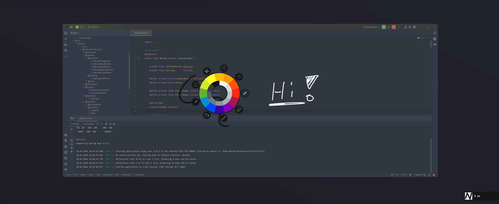

# viro

<div align="center">
  <a href="https://www.oracle.com/java/" target="_blank">
    
  </a>
  <a href="https://github.com/micartey/viro/actions/workflows/maven-build-and-release.yml" target="_blank">
    
  </a>
</div>

<br />

<p align="center">
  <a href="#-introduction">Introduction</a> •
  <a href="#-getting-started">Getting Started</a> •
  <a href="https://github.com/micartey/viro/issues">Troubleshooting</a>
</p>

## 📚 Introduction

viro is a java overlay doodle application meant to quickly draw and highlight things in screen sharings or recordings.
It is implemented in JavaFx and builds on the Spring Boot framework.



### Architecture

Due to scalability and ease of development, an event-based architecture is being used.
Most parts are covered by the build-in event system of Spring Boot, some other parts are covered
by [jation](https://github.com/micartey/jation).
jation is being used to only execute events for the current selected brush.
It provides a possibility to add a filter before invoking a method, which checks if the brush is the selected brush.
The code can be
found [here](https://github.com/micartey/viro/blob/1a8fa0810a2b03d8fedd1727def66c3e9a417cc9/src/main/java/me/micartey/viro/input/MouseObserver.java#L49-L62).

### Development

*(Writing this for future me in order to not spend an entire evening to get this up and running)*

1. Create a `.sdk` folder
2. Download a [javafx-sdk](https://gluonhq.com/products/javafx/) and extract it into the `.sdk` folder.
   The resulting structure should be: `.sdk/<your-fx-sdk>/lib`
3. Edit the Run configuration in your ide and add the following JVM flag

```
--module-path ./.sdk/<your-fx-sdk>/lib --add-modules javafx.controls,javafx.fxml,javafx.graphics
```

or install a sdk with javaFx bundled.

```nix
programs.java = {
    enable = true;
    package = (pkgs.jdk17.override { enableJavaFX = true; });
};
```

### Build

4. Build the application with Maven. Make sure to skip tests:

```shell
mvn package -B -DskipTests=true -f pom.xml
```

## Getting Started

Go to the [releases](https://github.com/micartey/viro/releases) and download the newest version of viro.
This can either be a commit or the latest stable version.
As both should work you can choose for yourself.

You also need to have a Java version newer or equal to Java 17.
For some systems, you should also use a java runtime pre-bundled with JavaFX.
Although viro also bundles java-fx, it is not necessarily sufficent for all Linux distros.

### Hyprland

For Hyprland I recommend to set the following window rules for a proper experience.

```nix
wayland.windowManager.hyprland.settings.windowrulev2 = [
    "float,class:(.*)viro(.*)$"
    "bordersize 0, class:(.*)viro(.*)$"
    "noblur, title:^(Radial-Menu)$"
    "noshadow, title:^(Radial-Menu)$"
];
```

### Shortcuts

There are some shortcuts you can use.
They are currently not configurable, but will be in the feature.
At the moment, the following shortcuts are pre-defined and static:

<br />

| Shortcut            | Name         | Description                                  |
|---------------------|--------------|----------------------------------------------|
| CTRL + Z            | Undo         | Remove shape                                 |
| CTRL + Y            | Redo         | Recreate removed shape                       |
| CTRL + SHIFT + I    | Import Image | Import a png / jpg into the scene            | 
| CTRL + SHIFT + ENTF | Clear        | Remove all shapes and reset background color | 
