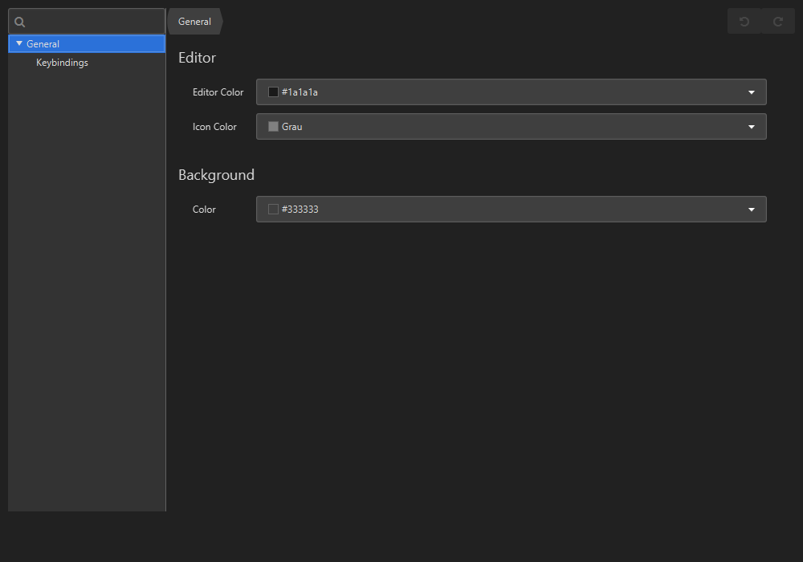

# viro

<div align="center">
  <a href="https://www.oracle.com/java/" target="_blank">
    
  </a>
  <a href="https://github.com/Clientastisch/viro/actions/workflows/maven-publish.yml" target="_blank">
    
  </a>
  <a href="https://clientastisch.github.io/viro/docs" target="_blank">
    
  </a>
</div>

<br />

<p align="center">
  <a href="#-introduction">Introduction</a> •
  <a href="#-installation">Installation</a> •
  <a href="https://github.com/Clientastisch/viro/issues">Troubleshooting</a>
</p>


## 📚 Introduction

Viro is a Java doodle application. It is based on the [Spring](https://spring.io/) framework and uses JavaFX for rendering.


### Motivation

This project was created in order to have an overlay doodle application which is perfectly useful for screen sharing with the combination of drawing tablets.

## 🔎 Compatibility

- [x] [Windows](https://www.microsoft.com/)
- [x] [Java 8](https://github.com/AdoptOpenJDK/openjdk-jdk8u)

## 💿 Installation

To use viro, you must have Java installed or use the [bundled zip](https://github.com/Clientastisch/viro/releases) available on the release tab. In case you downloaded the source and want to compile it, make sure to have `maven` installed and run:

**(This step is only optional)**
```bash
$ mvn package -B -ntp -DskipTests=true -f pom.xml
```

## ⚙ Settings

Viro uses [PreferenceFx](https://github.com/dlsc-software-consulting-gmbh/PreferencesFX) to store, display and load settings. You Also have the possibility to set your own keybindings.



## ⌨ Default Keybindings

| Key | Action |
| --- | --- |
| `ALT + PAUSE` | Show |
| `ESC` | Hide |
| `DELETE` | Clear Canvas |
| `STRG + Z` | Undo |
| `STRG + Y` | Redo |